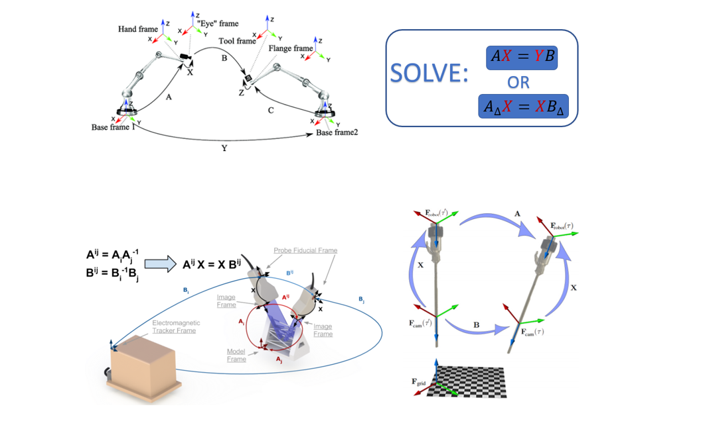
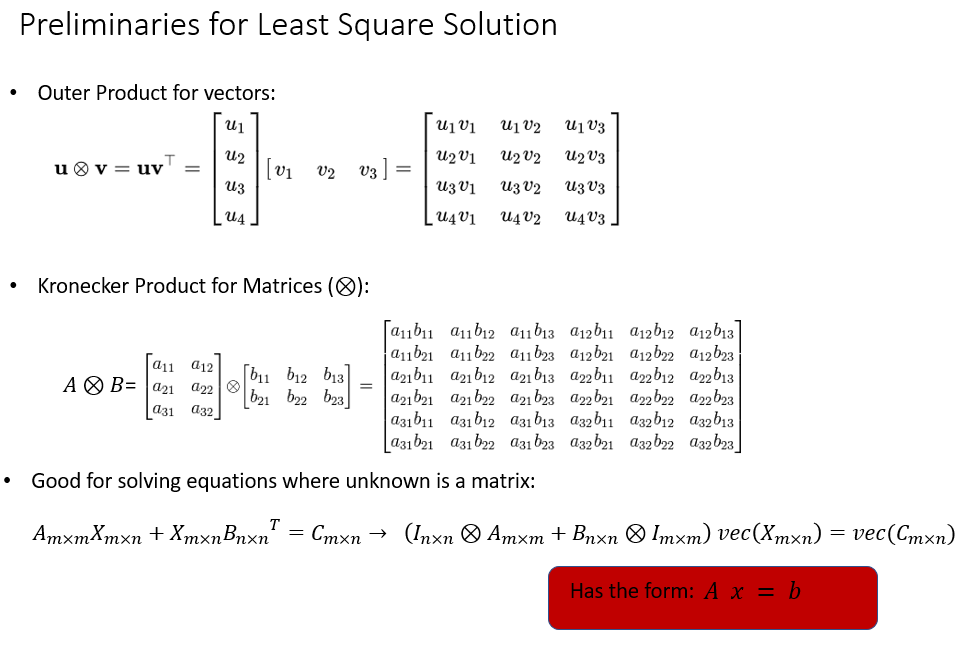
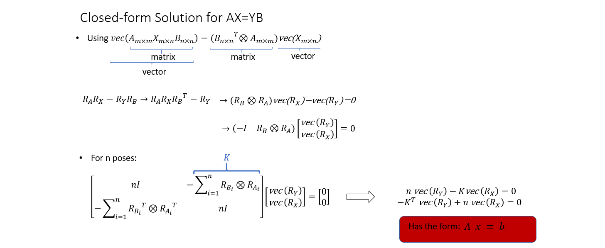
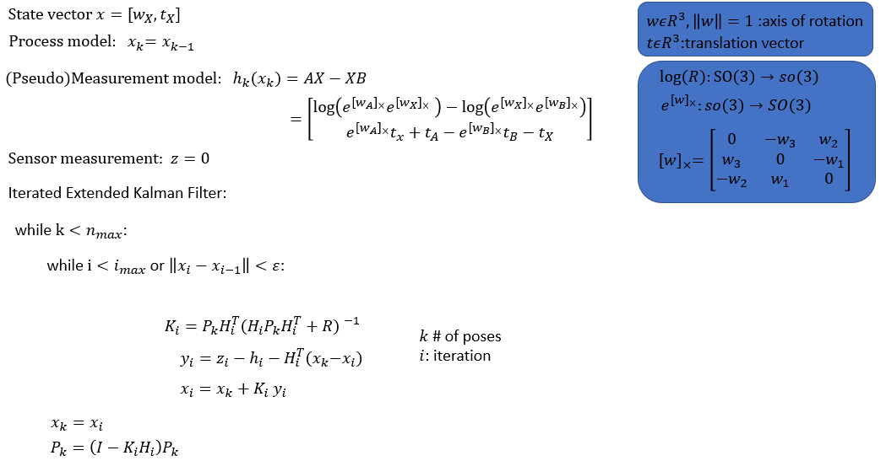
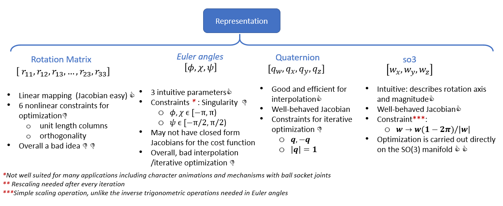

## POSE ESTIMATION FOR SENSOR CALIBRATION

Many sensor calibration and pose estimation problems in robotics require solving equations of the form AX=XB or AX=YB to obtain the homogeneous transforms X and Y from a set of (A,B) paired measurements.

Pose_Estimation.py has several implementations that can be used based on the application needs.

## Batch Processing

Batch processing class formulates the problem using Kronecker product and finds the least square solution using n pairs of data. If there is no sensor noise, theoretically, you need 3 unique poses (rotation axis) to get a solution. In practice, there is almost always sensor noise.

## Iterated Extended Kalman Filter 
EKF is well-suited for applications where it takes significant time to collect and process paired measurements. The implementation consumes a single pair of measurements to update the state at every time step and requires many iterations to converge.  For highly nonlinear functions such as this application, where we estimate the pose, EKF can significantly underestimate the covariance. To alleviate this, an iterated extended kalman filter (IEKF) can be used. The main difference between EKF and IEKF is the measurement update step. IEKF iterates over the measurement update step for a fixed number of iterations or until a stopping criterion is met. This allows linearizing about better estimates and improves approximation each iteration.
Innovation or the norm of the difference between the consequent state estimates can be used as a stopping criterion. It's important to note that, the state covariance matrix is kept fixed during this iterative step and only the state estimate is iterated. If we were to also update the covariance matrix, it would mean we process two identical measurements.  Once the iterations end, we use the same EKF update equations to update the state and covariance. Please see [1] for the mathematical formulation of the EKF and IEKF. The implementation here follows the same notation. 

State parametrization is also very important. See the summary table below. I highly recommend reading [2] and [3] to understand representations of rotations. The implementation for EKF and IEKF uses so3 parameters to represent rotation. Last but not least, remember to check the consistency of the filter to make sure the filter is doing its job.

## Example Results

.....Ground Truth
GT[euler_rpy(deg) , pos(mm)]:   
[ 76.30060196  38.77721218 -74.55150586] [ 50.99212608 -86.24462964   8.47782809]  

.....Batch Processing Results

Batch[euler_rpy(deg) , pos(mm)]:   
[ 76.30060196  38.77721218 -74.55150586] [ 50.99212608 -86.24462964   8.47782809]

Error[euler_rpy(deg) , pos(mm)]:   
[ 1.42108547e-14 -1.42108547e-14 -1.42108547e-14] [ 2.84217094e-14 -4.26325641e-14  1.59872116e-14]

.....EKF Results

EKF  [euler_rpy(deg) , pos(mm)]:  
[ 76.24141729  38.82670737 -74.48902165] [ 50.97119911 -86.03332789   8.48336931]  

Error[euler_rpy(deg) , pos(mm)]:   
[-0.05918467  0.04949519  0.06248421] [-0.02092698  0.21130174  0.00554122]  

.....IEKF Results

IEKF [euler_rpy(deg) , pos(mm)]:  
[ 76.23106881  38.8189731  -74.48172679] [ 50.95899704 -86.09524455   8.47349281]  

Error[euler_rpy(deg) , pos(mm)]:   
[-0.06953314  0.04176092  0.06977907] [-0.03312905  0.14938509 -0.00433528]  

.....UKF Results  
UKF [euler_rpy(deg) , pos(mm)]:  
[ 76.33720549  38.82287797 -74.57740081] [ 50.88939532 -86.25505213   8.47571383]  
Error[euler_rpy(deg) , pos(mm)]:  
[ 0.03660353  0.04566579 -0.02589495] [-0.10273076 -0.01042249 -0.00211426]  

## References
_[1]_  Havlík, Jindřich, and Ondřej Straka. "Performance evaluation of iterated extended Kalman filter with variable step-length." Journal of Physics: Conference Series. Vol. 659. No. 1. IOP Publishing, 2015.

_[2]_ Blanco, Jose-Luis. "A tutorial on se (3) transformation parameterizations and on-manifold optimization." University of Malaga, Tech. Rep 3 (2010).

_[3]_ Grassia, F. Sebastian. "Practical parameterization of rotations using the exponential map." Journal of graphics tools 3.3 (1998): 29-48.

